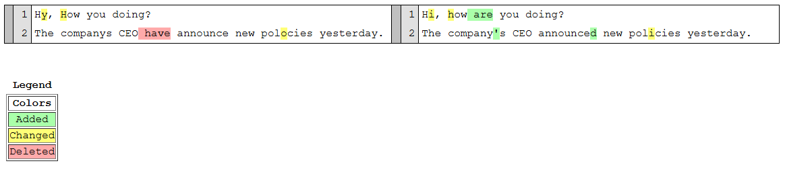

# **gspeech** *(“jee-speech”)* is your local **g**rammatical and **spe**lling **e**rror **ch**ecker

Thanks to [Karen](https://huggingface.co/FPHam/Karen_TheEditor_V2_STRICT_Mistral_7B), *gspeech* helps you revising your text focusing on US English spelling and grammatical errors without changing the style.

Tested on Windows *(so far)*, it operates locally and provides a detailed summary of changes, which is automatically displayed in your browser upon completion of text revision.

<br/><br/>
## Quickstart guide
0. Run ```karen_venv_build.py``` to download the [model from Hugging Face](https://huggingface.co/TheBloke/Karen_TheEditor_V2_STRICT_Mistral_7B-GGUF/blob/main/karen_theeditor_v2_strict_mistral_7b.Q8_0.gguf) and configure the virtual environment.
1. Paste the text to be revised into ```texts/source.txt```.
2. Run ```karen_chekcer.py```.

\
Once the text revision is completed, a window in your browser will open to show the changes proposed by *gspeech*.
Such changes are also saved into ```output/changes.html```.

<br/><br/>
## Example
```texts/source.txt``` already contains a simple example:
<pre>
Hy, How you doing?
The companys CEO have announce new polocies yesterday.
</pre>
And this is what you can expect as corresponding output from *gspeech*:
